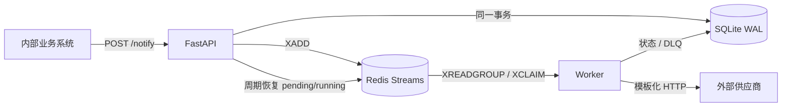

# API 通知中转服务(自动生成，agent调用见设计信息.md)

## 1. 问题理解

本服务把内部业务系统与不可靠、契约各异的外部 HTTP API 隔离开。业务方只需提交一次标准通知并立即得到可查询的 ID；服务负责持久化、异步投递、错误分类、有限重试和死信留档。投递语义是 **at-least-once**：系统优先保证不静默丢失，供应商侧仍应使用业务幂等标识抵御极端崩溃窗口造成的重复调用。

## 2. 快速启动

```bash
docker compose up --build -d
curl http://localhost:8000/health

curl -X POST http://localhost:8000/notify \
  -H "Content-Type: application/json" \
  -H "Idempotency-Key: demo-001" \
  -d '{"vendor":"ads_system_a","event_type":"user_registered","payload":{"user_id":"u_123","campaign_id":"cmp_456","timestamp":"2026-09-01T10:00:00Z"}}'
```

查询返回的 ID：

```bash
curl http://localhost:8000/notifications/REPLACE_WITH_NOTIFICATION_ID
```

示例外部域名不可达是预期行为，worker 会重试。完整的本地成功链路见“测试”中的 Docker 冒烟命令。

## 3. 整体架构



- API 层只做校验、原子落库和入队，不同步请求供应商。
- SQLite 是通知状态和恢复事实源；WAL、5 秒 busy timeout 和 NullPool 缓解低吞吐多进程写锁。
- Redis Streams 提供 consumer group、ack 和 stale claim，解耦入口与投递。
- worker 根据 YAML 渲染 URL、header 和 JSON body，执行一次状态转换。

## 4. 关键工程决策

### 4.1 投递语义：At-least-once

先落库再入队，数据库 pending/running 扫描和 Streams pending claim 可恢复崩溃中的任务。供应商返回 2xx 后、XACK 前 worker 崩溃仍可能重复调用，这是 at-least-once 的固有边界，不承诺 exactly-once。

### 4.2 队列：Redis Streams

Streams 已能满足 MVP 的持久消息、消费组和未确认消息回收，不需要 Kafka/RabbitMQ 的额外运维面。不使用队列的替代方案是 DB polling，但会把调度查询压力和业务状态表耦合。

### 4.3 供应商差异：YAML 配置

供应商差异是数据而非类层次：endpoint、method、header、body 和 event allow-list 均由 YAML 描述，Jinja2 使用 `StrictUndefined` 防止缺字段静默变成空串。没有 Adapter 工厂或继承体系。

### 4.4 数据库：SQLite

SQLite 让评审者无需额外数据库即可启动，适合低吞吐 MVP。它的单文件、多进程并发写能力有限；这里使用共享 named volume、WAL、busy timeout 和短事务缓解，生产放量时应迁移 PostgreSQL。

### 4.5 重试与错误分类

- 2xx：成功。
- 408、429、5xx、timeout、connect error 和未知异常：可重试。
- 其余 3xx/4xx、模板渲染失败、供应商配置缺失：不可重试，进入 DLQ。
- 最多实际调用 10 次；首次失败等待约 1 秒，指数增长并带 ±20% jitter，封顶 300 秒。
- 429 优先采用 `Retry-After` 秒数或 HTTP-date。

延迟等待采用内存中的 `asyncio.sleep`。worker 重启时，数据库 `next_retry_at` 仍保留，API 每 30 秒重新入队到期项，因此可能额外延迟不超过一个扫描周期。

### 4.6 幂等策略

独立 `idempotency_keys` 表以 key 为主键，在同一事务内与通知一同写入，解决并发竞态。24 小时后后台清理 key；原通知仍保留。同 key 命中 dead 也返回 200 和当前状态，调用方决定是否用新 key 重投。

## 5. 系统边界

### 5.1 我解决的

标准入口、24 小时入口幂等、异步投递、配置化供应商、有限重试、DLQ、状态查询、依赖健康检查、结构化日志、进程/任务恢复。

### 5.2 我不解决的

鉴权、多租户、限流、熔断、管理 UI、回调、DLQ 自动回灌、供应商 exactly-once、通用 JSON Schema、指标平台和数据库 migration。这些都会扩大 MVP 的实现或运维面；内部信任和低吞吐假设下收益不足。

## 6. 可靠性设计

### 6.1 消息不丢

notification 与幂等 key 原子提交后才 XADD。commit 与 XADD 之间崩溃由数据库 pending 扫描补偿；running 超过 60 秒会重置为 pending。worker 对 Redis 消息完成状态落库后才 XACK。

### 6.2 重复的真实边界

入口重复由 24 小时 key 抑制；队列重复由终态检查跳过。但供应商 2xx 与本地成功提交之间崩溃仍会重投，所以下游应按业务 key 去重。

### 6.3 外部长期不可用

指数退避防止打爆供应商或自身，10 次上限阻止无限积压，最终通知和完整快照进入 dead_letters，保留人工诊断与未来回灌所需信息。

## 7. 目录结构

```text
app/api           API 契约和路由
app/db            SQLAlchemy 模型与短事务仓储
app/dispatcher    YAML、渲染、HTTP 与重试纯函数
app/queue         Redis Streams 封装
app/worker        consumer 与分发状态机
config            供应商模板
tests             单元、集成、E2E 与 smoke fake vendor
docs              设计、AI 使用和测试报告
```

## 8. 测试

本地测试：

```bash
python -m pip install -e ".[dev]"
python -m pytest --cov=app --cov-report=term-missing --cov-fail-under=60
python -m ruff check .
python -m compileall -q app tests
```

Docker 成功链路冒烟（先在另一个终端启动 fake vendor）：

```bash
python tests/fake_vendor_server.py
docker compose up --build -d
curl -X POST http://localhost:8000/notify \
  -H "Content-Type: application/json" \
  -H "Idempotency-Key: smoke-001" \
  -d '{"vendor":"smoke_vendor","event_type":"smoke","payload":{"message":"hello"}}'
curl http://localhost:8000/notifications/REPLACE_WITH_NOTIFICATION_ID
```

实测结果见 [docs/test-report.md](docs/test-report.md)。`pytest-cov` 是唯一超出 final PRD dev 白名单的直接依赖，因为 DoD 明确要求 `pytest --cov`，没有插件该命令不可执行。

## 9. 未来演进

1. PostgreSQL 替代 SQLite，支持并发写和高可用。
2. Redis Sorted Set scheduler 替代内存 delay，缩短重启恢复延迟。
3. 按供应商提供 JSON Schema 和版本化契约。
4. 增加鉴权、租户配额和供应商级限流/熔断。
5. 增加 DLQ 管理、审计和安全回灌工具。
6. 输出 Prometheus 指标、trace 和 SLO 仪表盘。
7. 对高流量分区 Streams，水平扩展 worker。

## 10. AI 使用说明

见 [docs/ai-usage.md](docs/ai-usage.md)。完整设计细节见 [docs/design.md](docs/design.md)。

