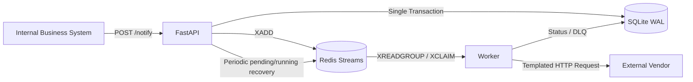

# API Notification Relay Service

## 1. Problem Statement

This service isolates internal business systems from unreliable external HTTP APIs with different request contracts. A caller submits one standardized notification and immediately receives a queryable ID. The service then handles persistence, asynchronous delivery, error classification, bounded retries, and dead-letter storage.

The delivery guarantee is **at least once**. The system prioritizes preventing silent message loss. In the rare failure window where a duplicate downstream request is possible, the vendor should use a business idempotency identifier to deduplicate requests.

## 2. Quick Start

```bash
docker compose up --build -d
curl http://localhost:8000/health

curl -X POST http://localhost:8000/notify \
  -H "Content-Type: application/json" \
  -H "Idempotency-Key: demo-001" \
  -d '{"vendor":"ads_system_a","event_type":"user_registered","payload":{"user_id":"u_123","campaign_id":"cmp_456","timestamp":"2026-09-01T10:00:00Z"}}'
```

Query the returned notification ID:

```bash
curl http://localhost:8000/notifications/REPLACE_WITH_NOTIFICATION_ID
```

The example external vendor domains are intentionally unreachable. The worker will retry those requests as designed. See the Testing section for a complete local success-path smoke test.

## 3. Architecture



- The API layer performs validation, atomic persistence, and queue insertion only. It never calls a vendor synchronously.
- SQLite is the source of truth for notification state and recovery. WAL mode, a five-second busy timeout, and `NullPool` mitigate low-throughput multi-process write contention.
- Redis Streams provides consumer groups, acknowledgements, and stale-message claiming, decoupling request acceptance from delivery.
- The worker renders the URL, headers, and JSON body from YAML before executing one state transition.

## 4. Key Engineering Decisions

### 4.1 Delivery Semantics: At Least Once

The API persists a notification before adding it to Redis. Database scans for pending and running records, together with Redis pending-message claiming, recover interrupted work.

A worker may still crash after receiving a vendor HTTP 2xx response but before acknowledging the stream message. This can result in a duplicate vendor call and is an inherent limitation of at-least-once delivery. The service does not claim exactly-once behavior.

### 4.2 Queue: Redis Streams

Redis Streams provides the durable messages, consumer groups, and unacknowledged-message recovery required by this MVP without the operational footprint of Kafka or RabbitMQ.

The alternative without a queue would be database polling, which would couple scheduling load directly to the business state tables.

### 4.3 Vendor Differences: YAML Configuration

Vendor differences are treated as data rather than a class hierarchy. Endpoint, method, headers, body template, timeout, and optional event allow-list are declared in YAML. Jinja2 uses `StrictUndefined`, preventing missing fields from silently rendering as empty strings.

There is no vendor Adapter inheritance tree or factory.

### 4.4 Database: SQLite

SQLite lets reviewers start the service without provisioning another database and is suitable for a low-throughput MVP. Its single-file, multi-process write concurrency is limited.

The implementation mitigates this with a shared named volume, WAL mode, a busy timeout, `NullPool`, and short transactions. A production deployment with materially higher traffic should migrate to PostgreSQL.

### 4.5 Retry and Error Classification

- HTTP 2xx: mark the notification as successful.
- HTTP 408, 429, 5xx, timeouts, connection errors, and unknown exceptions: retry.
- Other HTTP 3xx/4xx responses, template rendering failures, and missing vendor configuration: do not retry; move the notification to the DLQ.
- Make no more than ten actual HTTP attempts.
- After the first failure, wait approximately one second. The delay then grows exponentially with ±20% jitter and is capped at 300 seconds.
- For HTTP 429, honor a valid `Retry-After` value expressed either as seconds or an HTTP date.

Delayed requeueing uses an in-memory `asyncio.sleep`. If the worker restarts, `next_retry_at` remains in the database and the API recovery loop re-enqueues due records every 30 seconds. A restart may therefore add up to one recovery interval of latency.

### 4.6 Idempotency

The dedicated `idempotency_keys` table uses the key as its primary key. The notification and idempotency record are inserted in one transaction, resolving concurrent submission races.

Keys are deleted after 24 hours while the original notification remains available. Reusing a key whose notification is already dead still returns HTTP 200 with the current `dead` status. The caller may use a new key if it intentionally wants to submit the notification again.

## 5. System Boundaries

### 5.1 Included

- Standard notification submission API
- 24-hour request idempotency
- Asynchronous delivery
- YAML-configured vendors
- Bounded retry policy
- Dead-letter storage
- Notification status lookup
- Database and Redis health checks
- Structured JSON logs
- Process and task recovery

### 5.2 Explicitly Excluded

- Authentication and authorization
- Multi-tenancy
- Rate limiting and circuit breaking
- Administrative UI
- Caller callbacks
- Automatic DLQ replay
- Exactly-once vendor delivery
- General-purpose JSON Schema validation
- Metrics or tracing platforms
- Database migration framework

These features would increase the implementation and operational scope without sufficient benefit under the trusted-network and low-throughput MVP assumptions.

## 6. Reliability Design

### 6.1 Preventing Silent Message Loss

The notification and idempotency key are committed atomically before `XADD`. A crash between the database commit and `XADD` is repaired by scanning due pending records. A running notification older than 60 seconds is reset to pending. The worker acknowledges the Redis message only after persisting the resulting state.

### 6.2 The Real Duplicate Boundary

The 24-hour idempotency key suppresses duplicate API submissions. Terminal-state checks suppress duplicate stream deliveries after local completion. However, a crash between a vendor 2xx response and the local success commit can still result in a repeated downstream call, so downstream business-level idempotency remains necessary.

### 6.3 Long-Term Vendor Failure

Exponential backoff avoids overwhelming the vendor or this service. The ten-attempt limit prevents unbounded queue growth. A terminal notification and its complete snapshot are written to `dead_letters`, preserving the information needed for diagnosis and a future replay tool.

## 7. Project Structure

```text
app/api           API contracts and routes
app/db            SQLAlchemy models and short-transaction repository
app/dispatcher    YAML loading, rendering, HTTP, and retry functions
app/queue         Redis Streams abstraction
app/worker        Consumer and dispatch state machine
config            Vendor templates
tests             Unit, integration, E2E, and smoke fake-vendor tests
docs              Design, AI usage, and test report
```

## 8. Testing

Run the local test suite:

```bash
python -m pip install -e ".[dev]"
python -m pytest --cov=app --cov-report=term-missing --cov-fail-under=60
python -m ruff check .
python -m compileall -q app tests
```

Run the successful Docker smoke path by starting the fake vendor in a separate terminal first:

```bash
python tests/fake_vendor_server.py
docker compose up --build -d

curl -X POST http://localhost:8000/notify \
  -H "Content-Type: application/json" \
  -H "Idempotency-Key: smoke-001" \
  -d '{"vendor":"smoke_vendor","event_type":"smoke","payload":{"message":"hello"}}'

curl http://localhost:8000/notifications/REPLACE_WITH_NOTIFICATION_ID
```

Verified results:

- 45 of 45 automated tests passed.
- Total application coverage: 77.36% (required: 60%).
- Docker API, worker, and Redis containers all reached healthy status.
- A real containerized delivery completed as `202 pending → success`, with one attempt and vendor HTTP 200.
- Sequential persistent-connection benchmark: p99 61.63 ms.
- Ten-client concurrent benchmark: all 100 requests returned HTTP 202, but p99 was 2233.70 ms, demonstrating the documented SQLite concurrency limitation.

See [docs/test-report.md](docs/test-report.md) for the full executed test report.

`pytest-cov` is the only direct dependency added beyond the final PRD development allow-list. It is required because the Definition of Done explicitly requires a `pytest --cov` command, which is unavailable without that plugin.

## 9. Future Evolution

1. Replace SQLite with PostgreSQL for concurrent writes and high availability.
2. Replace in-memory retry delays with a Redis Sorted Set scheduler.
3. Add versioned JSON Schemas for each vendor contract.
4. Add authentication, tenant quotas, vendor rate limits, and circuit breakers.
5. Add audited DLQ administration and safe replay tooling.
6. Export Prometheus metrics, traces, and SLO dashboards.
7. Partition Redis Streams and scale workers horizontally for higher traffic.

## 10. AI Usage

See [docs/ai-usage.md](docs/ai-usage.md) for the AI usage statement and [docs/design.md](docs/design.md) for the detailed design.

