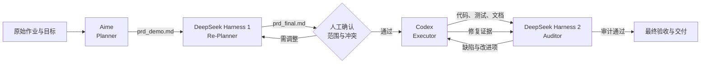

# Vibe coding中 多 Agent 协作设计说明

## 1.  角色与职责

| Agent | 角色 | 主要输入 | 核心职责 | 主要输出 | 不负责 |
| --- | --- | --- | --- | --- | --- |
| Aime | Planner（规划者） | 原始作业说明、目标与约束 | 理解问题、划定 MVP 边界、设计初版架构和验收标准 | [prd_demo.md](prd_demo.md) | 编写最终实现、为实现结果背书 |
| DeepSeek Harness 1 | Re-Planner（再规划者） | `prd_demo.md`、原始要求 | 消除歧义，补充接口、数据模型、失败策略、测试方法和 DoD，使需求可直接执行 | [prd_final.md](prd_final.md) | 代替执行者验证代码真实性 |
| Codex | Executor（执行者） | `prd_final.md`、审计反馈、人工确认的决策 | 交叉核对约束，记录冲突，分阶段实现、测试、修复并形成工程文档 | `app/`、`tests/`、配置、README、测试与设计文档 | 擅自扩大范围或掩盖未通过项 |
| DeepSeek Harness 2 | Auditor（审计者） | `prd_final.md`、实现方案或代码结果 | 从正确性、可靠性、边界条件和可验收性角度独立审查，指出缺陷并给出优先级 | 审计意见；设计问题沉淀到 `prd_final.md` 附录和开发决策记录 | 直接修改实现、替代最终验收 |

人工负责人是最终决策者：确认需求冲突的处理基线、决定是否接受范围或依赖变化，并对交付结果负责。

## 2. 编排流程



主链路为：

```text
Aime → DeepSeek Harness 1 → 人工门禁 → Codex ↔ DeepSeek Harness 2 → 最终验收
```

其中 `Codex ↔ Auditor` 是有终止条件的反馈闭环，不是无限讨论：阻断性问题修复后必须提供测试或文档证据；非 MVP 项记录为后续演进，不在本轮持续扩张。

## 3. 阶段交接与质量门禁

### 3.1 Planner → Re-Planner

交接物是 `prd_demo.md`。初版至少应包含：问题定义、范围内/外事项、架构选择、关键接口、数据模型、错误处理、实施阶段和验收思路。

进入下一阶段前检查：

- 目标、使用者和成功标准是否清楚；
- MVP 边界是否明确，是否避免无依据增加组件；
- 可靠性、幂等、重试和失败终态是否被考虑；
- 关键假设是否显式记录。

### 3.2 Re-Planner → Executor

交接物是 `prd_final.md`。它应把“方向性描述”转成“可验证契约”，包括：

- MUST / MUST NOT 边界和依赖白名单；
- API 字段、状态码、数据表与状态机；
- HTTP 错误分类、重试上限和退避公式；
- 分阶段 Acceptance Criteria；
- 测试推导方法、最小用例集和 Definition of Done；
- 已知冲突、风险和待人工决策项。

本项目在实现前又对 final PRD 识别出 12 个歧义或冲突，例如重试次数 off-by-one、SQLite 跨容器写入、延迟重试恢复和跨进程 HTTP mock。它们先记录在 [开发进程.md](开发进程.md)，经人工确认后才成为执行基线。

### 3.3 Executor → Auditor

执行者不仅交付代码，还应提交可复核证据：

- 实现：`app/`、`config/`、`Dockerfile`、`docker-compose.yml`；
- 自动化验证：`tests/`、静态检查与编译检查；
- 设计解释：[README.md](README.md) 与 [docs/design.md](docs/design.md)；
- 验收结果：[docs/test-report.md](docs/test-report.md)；
- AI 决策披露：[docs/ai-usage.md](docs/ai-usage.md)。

执行阶段按 `prd_final.md` 的 Phase 1～5 推进。每一阶段的 AC 通过后再进入下一阶段；测试失败必须定位原因并留下修正结果，不能只报告最终绿灯。

### 3.4 Auditor → Executor

审计意见按影响分级：

- **P0 / 阻断**：违反硬性契约、存在数据丢失或核心路径不可运行，必须修复后交付；
- **P1 / 重要**：可靠性、边界或验收方法不完整，应给出方案并在本轮决策；
- **P2 / 改进**：不阻断 MVP，但需要记录风险或进入未来演进。

每条意见应包含“问题、影响、证据、建议、验收方式”。执行者的响应只能是以下三种之一：

1. **接受并修复**：附代码差异和验证结果；
2. **部分接受**：说明保留边界与补偿措施；
3. **不采纳**：给出契约、范围或工程取舍依据。

`prd_final.md` 的“评审待完善项记录”体现了这一机制：P1 提供修改建议，P2 保留问题；最终采用与未采用的取舍则记录在 `开发进程.md` 和 `docs/ai-usage.md`。

## 4. 需求与产物追踪

| 关注点 | 需求来源 | 实现位置 | 验证或说明 |
| --- | --- | --- | --- |
| API 契约与入口幂等 | `prd_final.md` §3、§4 | `app/api/`、`app/db/` | `tests/test_api_notify.py`、`tests/test_idempotency.py` |
| Redis Streams 与恢复 | `prd_final.md` §7 | `app/queue/`、`app/main.py` | `tests/test_queue.py`、`tests/test_recovery.py` |
| 分发、错误分类与重试 | `prd_final.md` §6、§7 | `app/dispatcher/`、`app/worker/` | `tests/test_dispatcher.py`、`tests/test_retry_policy.py` |
| DLQ 与终态 | `prd_final.md` §4、§6 | `app/db/engine.py`、`app/worker/tasks.py` | 分发与 E2E 测试 |
| 端到端交付质量 | `prd_final.md` §9、§14 | 全工程 | `docs/test-report.md`、README 测试命令 |

这张映射用于防止需求只停留在 PRD，也防止代码出现无法追溯到目标的额外设计。

## 5. 异常处理与停止条件

出现以下情况时暂停向下游交接，回到对应责任人处理：

- 原始要求与 final PRD 冲突：回到 Re-Planner，并由人工确认优先级；
- 两种方案会改变 API、依赖或 MVP 范围：执行者记录选项，不自行扩大权限；
- 审计问题缺乏复现证据：Auditor 补充场景或失败路径；
- 测试环境与真实运行边界不一致：重新定义测试层级，不用单进程 mock 冒充跨进程验证；
- 问题属于未来能力而非当前 DoD：登记为演进项，避免反馈闭环失控。

协作完成的判定条件是：硬性契约有实现映射，P0 已清零，P1 已修复或经人工接受，自动化测试与运行验证通过，剩余 P2 和系统边界已公开记录。

## 6. Token消耗
 - aime: 12次提问
 - codex：5x会员 周额度的8%
 - deepseek harness: 输入+输出约40M token,约7元
